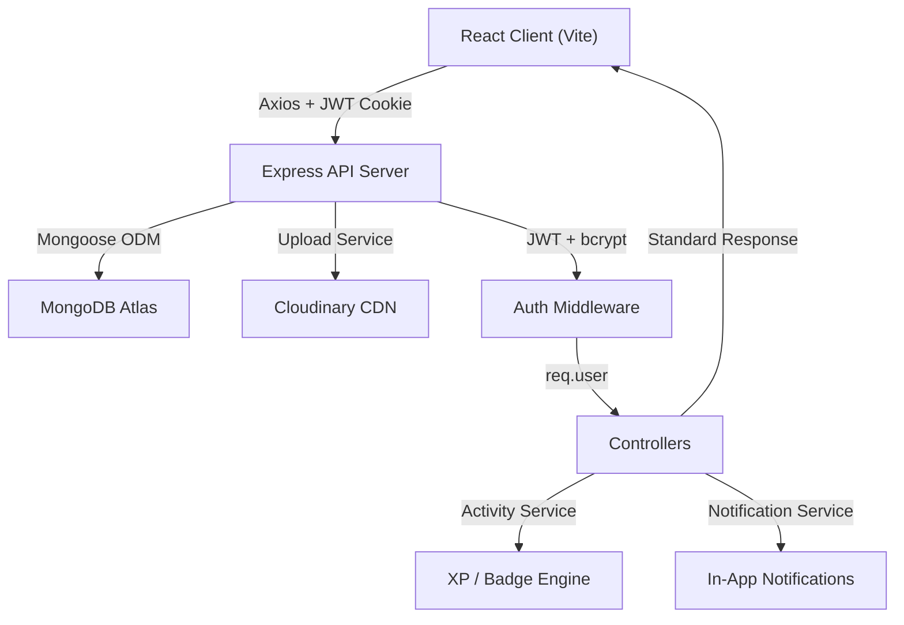

# 🚀 College Social & Collaboration Platform — Implementation Plan

Build a private digital ecosystem for college students: social feed, clubs, events, collaboration, gamification, and admin — as a monorepo with React + Vite frontend and Express + MongoDB backend.

---

## User Review Required

> [!IMPORTANT]
> **Tailwind CSS version**: Your spec says Tailwind CSS. I'll use **Tailwind CSS v3** (stable, well-documented). Let me know if you prefer v4.

> [!IMPORTANT]
> **TypeScript vs JavaScript**: Your spec mentions "JavaScript / TypeScript." I recommend **TypeScript throughout** (both client and server) for a project of this scale — it catches bugs early and improves collaboration. If you prefer plain JavaScript, let me know.

> [!WARNING]
> **MongoDB Atlas / Cloudinary / Email Verification**: These require API keys and accounts. For local development, I'll use a **local MongoDB connection string placeholder** and **local file upload stubs** that you can swap for Cloudinary later. Email verification will be **stubbed** (auto-verified in dev) so you can develop without an email service. You'll configure real credentials in `.env` when ready.

> [!IMPORTANT]
> **Scope**: Following your "build philosophy," I'll implement the **complete vertical slice MVP first** (auth → profile → feed → posts → clubs → events → collaboration → leaderboard → notifications → admin). This is a very large build. I'll follow the 8-week roadmap you defined.

---

## Open Questions

1. **College seeding**: Should I pre-seed a default college (e.g., "Demo College" with domain `college.edu`) so the app works out of the box, or do you want a setup wizard?

2. **Image uploads in MVP**: Should I integrate Cloudinary immediately, or use a simpler approach (base64 / local multer upload) for the MVP and swap in Cloudinary later?

3. **Real-time features**: You mentioned Socket.io is for V2. Confirm that MVP notifications are **poll-based** (fetch on page load / manual refresh)?

4. **Testing in initial build**: Should I write Jest/Vitest tests during initial implementation, or focus on getting the full vertical slice working first and add tests in the polish phase (Week 8)?

---

## Architecture Overview

```
college-platform/
│
├── client/                          # React + Vite + Tailwind
│   ├── src/
│   │   ├── assets/                  # Static assets, images
│   │   ├── components/              # Reusable UI components
│   │   │   ├── ui/                  # Base UI (Button, Input, Modal, Card, Badge...)
│   │   │   ├── layout/              # Sidebar, Header, MobileNav, PageLayout
│   │   │   ├── feed/                # PostCard, CreatePost, FeedFilters
│   │   │   ├── profile/             # ProfileCard, ProfileCompletion, SkillBadges
│   │   │   ├── clubs/               # ClubCard, ClubList, MemberList
│   │   │   ├── events/              # EventCard, EventCalendar, Registration
│   │   │   ├── projects/            # ProjectCard, ApplicationForm, TeamView
│   │   │   ├── leaderboard/         # LeaderboardTable, XPBadge, WeeklyChart
│   │   │   ├── notifications/       # NotificationList, NotificationItem
│   │   │   └── admin/               # AdminStats, DataTable, ModerationPanel
│   │   ├── pages/                   # Route-level page components
│   │   │   ├── auth/                # Login, Register, VerifyEmail
│   │   │   ├── Home.jsx
│   │   │   ├── Discover.jsx
│   │   │   ├── Profile.jsx
│   │   │   ├── Settings.jsx
│   │   │   ├── Clubs.jsx / ClubDetail.jsx
│   │   │   ├── Events.jsx / EventDetail.jsx
│   │   │   ├── Projects.jsx / ProjectDetail.jsx
│   │   │   ├── Leaderboard.jsx
│   │   │   ├── Notifications.jsx
│   │   │   └── admin/               # AdminDashboard, AdminStudents, etc.
│   │   ├── store/                   # Zustand stores
│   │   │   ├── authStore.js
│   │   │   ├── postStore.js
│   │   │   ├── clubStore.js
│   │   │   ├── eventStore.js
│   │   │   ├── notificationStore.js
│   │   │   └── uiStore.js
│   │   ├── hooks/                   # Custom React hooks
│   │   ├── lib/                     # Axios instance, helpers, constants
│   │   ├── validators/              # Zod schemas (shared validation)
│   │   ├── App.jsx
│   │   ├── main.jsx
│   │   └── index.css                # Tailwind directives + custom design tokens
│   ├── index.html
│   ├── vite.config.js
│   ├── tailwind.config.js
│   ├── postcss.config.js
│   └── package.json
│
├── server/                          # Express + MongoDB
│   ├── src/
│   │   ├── config/
│   │   │   ├── db.js                # MongoDB connection
│   │   │   ├── cloudinary.js        # Cloudinary config (stubbed)
│   │   │   └── constants.js         # Enums, roles, limits
│   │   ├── models/
│   │   │   ├── College.js
│   │   │   ├── User.js
│   │   │   ├── Post.js
│   │   │   ├── Comment.js
│   │   │   ├── Club.js
│   │   │   ├── ClubMember.js
│   │   │   ├── Event.js
│   │   │   ├── EventRegistration.js
│   │   │   ├── Project.js
│   │   │   ├── ProjectApplication.js
│   │   │   ├── Notification.js
│   │   │   ├── Activity.js
│   │   │   ├── Badge.js
│   │   │   ├── Report.js
│   │   │   └── Announcement.js
│   │   ├── controllers/
│   │   │   ├── authController.js
│   │   │   ├── userController.js
│   │   │   ├── postController.js
│   │   │   ├── commentController.js
│   │   │   ├── clubController.js
│   │   │   ├── eventController.js
│   │   │   ├── projectController.js
│   │   │   ├── leaderboardController.js
│   │   │   ├── notificationController.js
│   │   │   ├── searchController.js
│   │   │   └── adminController.js
│   │   ├── routes/
│   │   │   ├── authRoutes.js
│   │   │   ├── userRoutes.js
│   │   │   ├── postRoutes.js
│   │   │   ├── commentRoutes.js
│   │   │   ├── clubRoutes.js
│   │   │   ├── eventRoutes.js
│   │   │   ├── projectRoutes.js
│   │   │   ├── leaderboardRoutes.js
│   │   │   ├── notificationRoutes.js
│   │   │   ├── searchRoutes.js
│   │   │   └── adminRoutes.js
│   │   ├── middleware/
│   │   │   ├── auth.js              # JWT verify + attach req.user
│   │   │   ├── authorize.js         # Role-based authorization
│   │   │   ├── validate.js          # Zod validation middleware
│   │   │   ├── upload.js            # Multer config for file uploads
│   │   │   ├── rateLimiter.js       # Express rate limit configs
│   │   │   └── errorHandler.js      # Global error handler
│   │   ├── services/
│   │   │   ├── activityService.js   # XP tracking, anti-gaming
│   │   │   ├── notificationService.js
│   │   │   ├── badgeService.js      # Badge rule engine
│   │   │   └── uploadService.js     # Cloudinary / local upload abstraction
│   │   ├── validators/
│   │   │   ├── authValidator.js
│   │   │   ├── postValidator.js
│   │   │   ├── clubValidator.js
│   │   │   ├── eventValidator.js
│   │   │   ├── projectValidator.js
│   │   │   └── userValidator.js
│   │   ├── utils/
│   │   │   ├── ApiError.js          # Custom error class
│   │   │   ├── ApiResponse.js       # Standard response helper
│   │   │   ├── asyncHandler.js      # try/catch wrapper
│   │   │   └── helpers.js           # Misc utilities
│   │   ├── app.js                   # Express app setup
│   │   └── server.js                # Server entry point
│   ├── .env.example
│   └── package.json
│
├── .gitignore
├── README.md
└── package.json                     # Root workspace package.json
```

---

## Proposed Changes

### Phase 1 — Foundation (Days 1–2)

#### Repository & Project Setup

##### [NEW] Root `package.json` & `.gitignore`
- Monorepo workspace config with `client` and `server` workspaces
- Comprehensive `.gitignore` (node_modules, .env, dist, .DS_Store)

##### [NEW] `client/` — React + Vite + Tailwind
- Scaffold with `npx create-vite` using `react` template
- Install: `tailwindcss`, `postcss`, `autoprefixer`, `react-router-dom`, `axios`, `zustand`, `react-hook-form`, `@hookform/resolvers`, `zod`, `lucide-react`, `recharts`, `react-hot-toast`
- Configure Tailwind with custom color palette, design tokens
- Build the full design system in `index.css` (custom properties for colors, gradients, shadows, animations)
- Create base UI component library: Button, Input, Card, Modal, Badge, Avatar, Dropdown, Skeleton loaders

##### [NEW] `server/` — Express + MongoDB
- Initialize Node.js project
- Install: `express`, `mongoose`, `dotenv`, `cors`, `helmet`, `bcryptjs`, `jsonwebtoken`, `cookie-parser`, `express-rate-limit`, `zod`, `multer`, `cloudinary`
- Set up Express app with middleware chain (helmet, cors, rate-limit, cookie-parser, JSON parser)
- MongoDB connection with retry logic
- Global error handler with standard API response format
- `GET /api/v1/health` endpoint
- `.env.example` with all required variables

---

### Phase 2 — Authentication & Profile (Days 3–6)

#### Backend Auth

##### [NEW] `server/src/models/College.js`
- College schema: name, code, emailDomain, logo, location, admins, settings
- Pre-seed a default college on first run

##### [NEW] `server/src/models/User.js`
- User schema with all profile fields: name, email, password, avatar, bio, department, year, skills, interests, socialLinks, role, college (ref), activityPoints, badges, profileCompletion, isVerified, isActive
- Virtual field for profile completion percentage
- Pre-save hook for password hashing

##### [NEW] Auth system (`authController`, `authRoutes`, `authValidator`)
- `POST /api/v1/auth/register` — validate college email domain, create user, set JWT cookie
- `POST /api/v1/auth/login` — credential validation, JWT in HTTP-only cookie
- `POST /api/v1/auth/logout` — clear cookie
- `GET /api/v1/auth/me` — return current user
- JWT middleware (`authenticateUser`) and role middleware (`authorizeRole`)

##### [NEW] User profile system (`userController`, `userRoutes`, `userValidator`)
- `GET /api/v1/users/:id` — public profile
- `PUT /api/v1/users/profile` — update profile
- `PUT /api/v1/users/avatar` — upload avatar
- `GET /api/v1/users/search` — search by skill, name, department

#### Frontend Auth & Profile

##### [NEW] Auth pages (`Login.jsx`, `Register.jsx`)
- Premium glassmorphism login/register forms
- College email validation on frontend
- React Hook Form + Zod validation
- Auth store (Zustand) with persist

##### [NEW] Layout system (`Sidebar.jsx`, `Header.jsx`, `MobileNav.jsx`, `PageLayout.jsx`)
- Three-column dashboard layout (sidebar / main / trending panel)
- Mobile-first responsive with bottom tab navigation
- Smooth transitions between routes

##### [NEW] Profile page (`Profile.jsx`, `ProfileCard.jsx`, `ProfileCompletion.jsx`)
- Rich profile card with avatar, stats, skills, badges
- Profile completion progress bar with action items
- Settings page for editing profile

---

### Phase 3 — Social Feed & Posts (Week 2)

#### Backend

##### [NEW] Post system (`Post.js` model, `postController`, `postRoutes`)
- Post schema: author, college, content, images, category, likes[], likesCount, commentsCount
- `POST /api/v1/posts` — create post (with image upload)
- `GET /api/v1/posts` — feed with pagination, filtering by category, sorting (recent/popular/club)
- `POST /api/v1/posts/:id/like` — toggle like (array-based for MVP)
- `DELETE /api/v1/posts/:id` — soft delete
- `POST /api/v1/posts/:id/report` — report post

##### [NEW] Comment system (`Comment.js` model, `commentController`, `commentRoutes`)
- Comment schema: post (ref), author (ref), content, parentComment (ref for replies)
- `POST /api/v1/posts/:postId/comments` — add comment
- `GET /api/v1/posts/:postId/comments` — list with pagination
- `DELETE /api/v1/comments/:id` — delete own comment

##### [NEW] Report system (`Report.js` model)
- Report schema: reporter, targetType (post/comment/user), targetId, reason, status

#### Frontend

##### [NEW] Home/Feed page (`Home.jsx`, `PostCard.jsx`, `CreatePost.jsx`)
- Create post modal with category selector, image upload, rich text
- Feed with infinite scroll / pagination
- Post card with like animation, comment count, share
- Category filter tabs (All, Achievements, Projects, Questions, etc.)
- Trending sidebar with popular posts, top students

---

### Phase 4 — Club System (Week 3)

#### Backend

##### [NEW] Club system (models + controller + routes)
- `Club.js`: name, description, logo, banner, college, category, type (OPEN/APPROVAL), admin, members count, isApproved
- `ClubMember.js`: club, user, role (MEMBER/ADMIN/MODERATOR), status (PENDING/ACTIVE), joinedAt
- Endpoints:
  - `POST /api/v1/clubs` — request club creation
  - `GET /api/v1/clubs` — list clubs (filter by category, search)
  - `GET /api/v1/clubs/:id` — club detail with members, posts, events
  - `POST /api/v1/clubs/:id/join` — join/request membership
  - `PATCH /api/v1/clubs/:id/members/:userId` — approve/reject member (club admin)
  - `PUT /api/v1/clubs/:id` — update club (club admin)

#### Frontend

##### [NEW] Club pages (`Clubs.jsx`, `ClubDetail.jsx`, `ClubCard.jsx`)
- Club discovery with category filters and search
- Club detail page with tabs: About, Members, Posts, Events
- Club admin dashboard with member management
- Join/leave functionality with pending states

---

### Phase 5 — Events System (Week 4)

#### Backend

##### [NEW] Events system (models + controller + routes)
- `Event.js`: title, description, poster, date, time, location, organizer (club/college), registrationDeadline, maxParticipants, status (DRAFT/UPCOMING/ONGOING/COMPLETED/CANCELLED), registrationCount
- `EventRegistration.js`: event, user, status, registeredAt
- Endpoints:
  - `POST /api/v1/events` — create event (club admin / college admin)
  - `GET /api/v1/events` — list events (filter by status, date, organizer)
  - `GET /api/v1/events/:id` — event detail
  - `POST /api/v1/events/:id/register` — register for event
  - `DELETE /api/v1/events/:id/register` — cancel registration
  - `PATCH /api/v1/events/:id` — update event (organizer)

##### [NEW] Announcements (`Announcement.js` model + admin endpoints)
- Schema: title, content, college, author, category, priority (LOW/NORMAL/HIGH/URGENT), expiresAt
- `POST /api/v1/admin/announcements` — create (college admin)
- `GET /api/v1/announcements` — list active announcements

#### Frontend

##### [NEW] Event pages (`Events.jsx`, `EventDetail.jsx`, `EventCard.jsx`)
- Event discovery with date-based timeline view
- Event detail with registration form, attendee count
- Announcements banner on home page for HIGH/URGENT items

---

### Phase 6 — Collaboration Module (Week 5)

#### Backend

##### [NEW] Project collaboration (models + controller + routes)
- `Project.js`: title, description, owner, college, requiredSkills[], teamSize, status (OPEN/IN_PROGRESS/COMPLETED), members[], applications count
- `ProjectApplication.js`: project, applicant, message, status (PENDING/ACCEPTED/REJECTED)
- Endpoints:
  - `POST /api/v1/projects` — create project
  - `GET /api/v1/projects` — list (filter by skill, status)
  - `GET /api/v1/projects/:id` — project detail with team
  - `POST /api/v1/projects/:id/apply` — apply to project
  - `PATCH /api/v1/projects/:id/applications/:appId` — accept/reject
  - Skill-based student search: `GET /api/v1/users/search?skill=react`

#### Frontend

##### [NEW] Project pages (`Projects.jsx`, `ProjectDetail.jsx`, `ProjectCard.jsx`)
- Project listing with skill-based filters
- Project detail with team view, required skills, application form
- "Find Collaborators" — skill discovery page

---

### Phase 7 — Gamification & Leaderboard (Week 6)

#### Backend

##### [NEW] Activity & XP system (`Activity.js` model, `activityService.js`)
- Activity schema: user, college, type (enum of all actions), points, metadata, createdAt
- Point values per action type (as defined in spec)
- Anti-gaming: daily point caps (100 XP/day for social actions), cooldowns, duplicate detection

##### [NEW] Badge system (`Badge.js` model, `badgeService.js`)
- Badge definitions with automated rules (e.g., "Active Student" = 7 consecutive active days)
- Badge check runs on activity creation
- `GET /api/v1/users/:id/badges`

##### [NEW] Leaderboard (`leaderboardController`)
- `GET /api/v1/leaderboard/weekly` — top students this week (aggregation pipeline)
- `GET /api/v1/leaderboard/alltime` — all-time leaders
- `GET /api/v1/leaderboard/clubs` — top clubs by aggregate member XP

#### Frontend

##### [NEW] Leaderboard page (`Leaderboard.jsx`, `LeaderboardTable.jsx`, `XPBadge.jsx`)
- Weekly leaderboard with rank, avatar, name, XP, trend
- Club leaderboard
- Animated rank changes, trophy icons for top 3
- Recharts for activity over time

---

### Phase 8 — Admin & Notifications (Week 7)

#### Backend

##### [NEW] Notification system (`Notification.js` model, `notificationService.js`)
- Schema: recipient, type, message, data (polymorphic ref), isRead, createdAt
- `GET /api/v1/notifications` — list for current user
- `PATCH /api/v1/notifications/:id/read` — mark read
- `PATCH /api/v1/notifications/read-all` — mark all read
- Triggered from: likes, comments, club approvals, event registrations, project applications, announcements

##### [NEW] Admin panel (backend)
- `GET /api/v1/admin/dashboard` — aggregate stats (students, clubs, events, posts, reports)
- `GET /api/v1/admin/students` — list/search students with filters
- `PATCH /api/v1/admin/students/:id` — update role, suspend
- `GET /api/v1/admin/reports` — list reports
- `PATCH /api/v1/admin/reports/:id` — resolve (dismiss/delete/warn/suspend)
- `PATCH /api/v1/admin/clubs/:id/approve` — approve club creation
- `GET /api/v1/admin/analytics` — engagement metrics

##### [NEW] Search (`searchController`)
- `GET /api/v1/search?q=AI` — global search across students, clubs, events, projects, posts

#### Frontend

##### [NEW] Notification page/dropdown (`Notifications.jsx`, `NotificationDropdown.jsx`)
- Bell icon in header with unread count badge
- Notification list with type-based icons and actions
- Mark as read, mark all as read

##### [NEW] Admin pages (`AdminDashboard.jsx`, `AdminStudents.jsx`, `AdminClubs.jsx`, etc.)
- Stats cards (total students, active, clubs, events, posts, reports)
- Data tables with search, filter, pagination
- Moderation panel for reported content
- Club approval queue
- Recharts for analytics (registrations over time, engagement)

---

### Phase 9 — Polish & Production (Week 8)

##### Security hardening
- Rate limiting per endpoint
- Input sanitization
- File type/size validation
- MongoDB index optimization
- CORS config for production domains
- Helmet security headers

##### Responsive design
- Full mobile responsiveness audit
- Bottom tab navigation on mobile
- Touch-friendly interactions
- Progressive loading states

##### Performance
- API pagination everywhere
- Image optimization (Cloudinary transforms or lazy loading)
- Bundle splitting with React.lazy
- Skeleton loading states

##### Testing
- Backend: Jest + Supertest for auth, posts, clubs critical paths
- Frontend: Vitest + React Testing Library for forms, protected routes

---

## Data Flow Diagram



## API Response Standard

All endpoints follow:

```json
// Success
{ "success": true, "data": {}, "message": "Post created" }

// Error  
{ "success": false, "message": "Unauthorized", "code": "AUTH_REQUIRED" }

// Paginated
{ "success": true, "data": [], "pagination": { "page": 1, "limit": 20, "total": 150, "pages": 8 } }
```

---

## Verification Plan

### Automated Tests
- `cd server && npm test` — Jest + Supertest for API endpoints
- `cd client && npm test` — Vitest for component tests

### Manual Verification
1. **Auth flow**: Register → Login → Protected route → Logout
2. **Post flow**: Create post → Like → Comment → Feed display
3. **Club flow**: Create club → Admin approval → Join → Club posts
4. **Event flow**: Create event → Register → View attendees
5. **Collaboration flow**: Create project → Apply → Accept
6. **Gamification**: Actions generate XP → Leaderboard updates → Badge awarded
7. **Admin**: Dashboard stats → Moderate report → Approve club
8. **Mobile**: Responsive layout test on 375px, 768px, 1024px, 1440px

### Dev Server Verification
- Backend: `cd server && npm run dev` → `http://localhost:5000/api/v1/health`
- Frontend: `cd client && npm run dev` → `http://localhost:5173`
